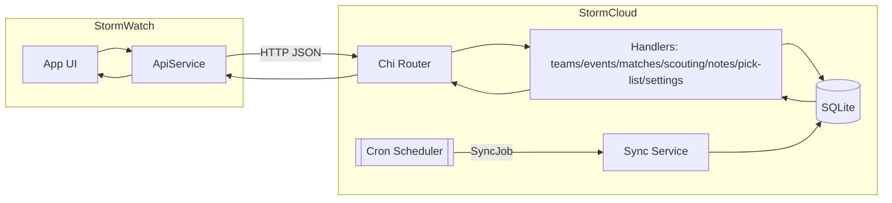

# StormCloud

FRC scouting and match analysis platform, built for team Red Storm 509 - Go backend with scheduled data sync with both web and mobile builds via React Native.


## Table of Contents
- [Overview](#overview)
- [Architecture](#architecture)
- [Screenshots / Demo](#screenshots--demo)
- [Quick Start](#quick-start)
- [Usage](#usage)
- [Configuration](#configuration)
- [Roadmap](#roadmap)
- [Contributing](#contributing)
- [Troubleshooting / FAQ](#troubleshooting--faq)
- [Security](#security)

## Overview
- An intuitive user interface for team members to keep track of and analyze teams, events, matches, notes, and scouting data.
- Ingests data from The Blue Alliance and Statbotics and persists to SQLite.
- Schedules sync jobs with an “Event Mode” for faster updates during competitions.
- Offers a WebSocket hub for lightweight realtime broadcast.

## Architecture
StormCloud is a service + mobile app:
- `stormcloud` (Go): Chi router serving REST endpoints under a configurable base path, WebSocket hub, ingest and scheduled sync jobs, and SQLite persistence.
- `stormwatch` (Expo/React Native): Cross-platform client consuming the API for scouting workflows and event viewing.



Key backend packages:
- `/api`: Router, handlers, CORS, base path, JSON health endpoints, REST API.
- `/db`: SQLite open/migrate with embedded SQL migrations.
- `/ingest`: TBA/Statbotics clients, events/teams/matches sync, EPA persistence.
- `/jobs`: Cron-based scheduler with normal vs event-mode specs.
- `/realtime`: Simple WebSocket hub for broadcasting.

### Project Layout

```
StormCloud/
├── stormcloud/               # Go service
│   ├── cmd/server/           # Server entrypoint
│   ├── internal/
│   │   ├── api/              # Router, handlers, CORS, base path
│   │   ├── db/               # SQLite open/migrate (embedded migrations)
│   │   ├── ingest/           # TBA/Statbotics sync, EPA persistence
│   │   ├── jobs/             # Cron scheduler, Event Mode
│   │   ├── models/           # Domain models
│   │   └── realtime/         # WebSocket hub
│   └── migrations/           # SQL migrations applied via embed
└── stormwatch/               # Expo/React Native app
    ├── src/components/       # UI components (forms, stream embed)
    ├── src/contexts/         # Theme/Auth/EventMode contexts
    ├── src/screens/          # Screens: Home, Teams, Scouting, Settings
    ├── src/utils/            # API client, config
    └── navigation/           # React Navigation stacks
```

## Screenshots / Demo

### Home Page


Event match list overview showing system status, event counts, and quick links.

### Teams


Teams directory with search and filters for quick lookup.

### Team Detail


Team detail page including EPA metrics, pit/scouting notes, and metadata.

### Match Scouting


Match scouting form for data entry and a submissions list.

### Pit Scouting


Pit scouting questionnaire capturing robot information and notes.

### Pick List


Pick list management with ordering, strikethrough for picked teams, and notes.

## Quick Start

Prerequisites
- Go `1.24+`
- Node.js `>=18` and `npm`
- Expo (`npm i -g expo` recommended for native targets)

Backend (Go)
- `cd stormcloud`
- Create `.env` with your secrets and configuration (see [Configuration](#configuration)).
- Run locally:
  - `go run ./cmd/server`
  - Or build: `go build -o bin/stormcloud ./cmd/server && ./bin/stormcloud`
- Health check: `curl http://localhost:8080/health` returns `{"status":"ok"}`

Mobile App (Expo/React Native)
- `cd stormwatch`
- `npm install`
- Set `EXPO_PUBLIC_APP_ENV=development` for localhost, or `EXPO_PUBLIC_APP_ENV=production` for Pi/hosted.
- Start:
  - Web: `npm run web`
  - Android: `npm run android`
  - iOS: `npm run ios`

## Usage

Health
- `GET /health` — JSON health.
- `GET /api/health` — health under base path.

Teams
- `GET /api/teams?search=<q>&limit=<n>` — search/list teams.
- `GET /api/teams/{team_key}` — team details with optional `epa` payload.
- `GET /api/teams/{team_key}/schedule?event=<event_key>` — team schedule within an event.
- `GET /api/teams/{team_key}/notes` — fetch pit/scouting notes and robot fields.
- `PUT /api/teams/{team_key}/notes` — update notes and robot fields.

Events & Matches
- `GET /api/events` — list configured events (from `events_config.json`). Optional `?year=YYYY`.
- `GET /api/events/{event_key}` — event details.
- `GET /api/events/{event_key}/matches` — matches for an event.

Scouting Forms
- `GET /api/form/{year}` — JSON-defined scouting form metadata.

Match Scouting
- `POST /api/match-scouting` — submit match scouting data.
- `GET /api/match-scouting/{match_key}/{team_key}` — get scouting data for a match/team.
- `GET /api/teams/{team_key}/match-scouting` — list match scouting entries for a team.

Pit Scouting
- `POST /api/pit-scouting` — submit pit scouting data.
- `GET /api/pit-scouting/{team_key}/{event_key}` — get pit scouting data.

Notes
- `GET /api/notes?match_key=<mk>` — list notes (optionally filtered).
- `POST /api/notes` — create a note.

Pick List
- `GET /api/pick-list?event_key=<ek>` — get ordered pick list (global list if omitted).
- `POST /api/pick-list` — save items for event or global list.

Auth & Settings
- `POST /api/auth` — simple password auth (`ACCESS_PASSWORD`).
- `GET /api/app-settings` — fetch app settings like Twitch channel URL.
- `GET /api/event-mode` — get Event Mode status.
- `POST /api/event-mode` — toggle Event Mode: `{ "event_mode": true|false }`.

WebSocket
- `GET /ws` — connect via WebSocket; messages are broadcast to all connected clients.

Sample Requests
```bash
# Search teams
curl "http://localhost:8080/api/teams?search=509&limit=10"

# Event matches
curl "http://localhost:8080/api/events/2024cmptx/matches" | jq '.[0]'

# Submit match scouting
curl -X POST "http://localhost:8080/api/match-scouting" \
  -H "Content-Type: application/json" \
  -d '{
    "match_key":"2024cmptx_qm1",
    "team_key":"frc509",
    "scout_name":"Alex",
    "auto_coral_l4":1,
    "teleop_coral_l2":2,
    "climb_level":"High",
    "defense_rating":4,
    "general_notes":"Solid auto, quick cycles"
  }'

# Toggle Event Mode
curl -X POST "http://localhost:8080/api/event-mode" \
  -H "Content-Type: application/json" \
  -d '{"event_mode":true}'
```

## Configuration

Environment Variables (backend)

| Name | Default | Description |
|------|---------|-------------|
| `APP_ENV` | `development` | Environment toggle: `development` or `production`. |
| `DATABASE_PATH` | `./app.db` | SQLite database path. WAL mode enabled via migrations. |
| `PORT` | `8080` | HTTP port. Ignored if `BIND_ADDR` is set. |
| `BIND_ADDR` | `127.0.0.1:${PORT}` in dev, `:${PORT}` in prod | Bind address. Override explicitly if needed. |
| `API_BASE_PATH` | `/api` | Base path for API routes. |
| `CORS_ALLOWED_ORIGINS` | dev: `http://localhost:8082,http://localhost:3000`; prod: `https://redstormcloud.com` | Comma-separated list. |
| `SYNC_CRON` | `0 */2 * * *` | Normal sync schedule (every 2 hours by default). |
| `EVENT_SYNC_CRON` | `*/3 * * * *` | Event Mode schedule (every 3 minutes). |
| `TBA_KEY` | — | TBA API key for ingestion. |
| `STATBOTICS_API_KEY` | — | Statbotics access (if applicable). |
| `CURRENT_YEAR` | `2025` | Year for team/event syncing and EPA selection. |
| `ACCESS_PASSWORD` | — | Password for `POST /api/auth`. |
| `TWITCH_CHANNEL_URL` | — | Used by the mobile app to embed stream. |

Environment Variables (mobile)
- `EXPO_PUBLIC_APP_ENV` — `development` or `production`.
- `EXPO_PUBLIC_API_BASE_URL` — optional explicit override for all environments.
- `EXPO_PUBLIC_DEV_API_BASE_URL` — optional dev base URL (default: `http://localhost:8080/api`).
- `EXPO_PUBLIC_PROD_API_BASE_URL` — optional production base URL (default native: `https://redstormcloud.com/api`; web uses `/api`).

Recommended toggles
- Local development:
  - Backend: `APP_ENV=development`
  - App: `EXPO_PUBLIC_APP_ENV=development`
- Raspberry Pi / production:
  - Backend: `APP_ENV=production`
  - App: `EXPO_PUBLIC_APP_ENV=production`

Events Config (`stormcloud/events_config.json`)
```json
{
  "sync_settings": {
    "sync_all_teams": false,
    "sync_event_teams_only": true,
    "enable_epa_sync": true,
    "current_year": 2025
  },
  "tba_keys": ["2024cmptx"],
  "statbotics_keys": ["2024cmptx"]
}
```

## Roadmap
- Authentication and per-user roles / token-based auth.
- Expand realtime events (server-sent match updates and notifications).
- Harden ingestion with retries/backoff and richer EPA data mapping.
- CI for backend and app; add linting and unit tests.
- Containerization and one-command deployment.
- Admin UI for pick list, notes, and event management.

## Contributing
- Fork and create feature branches; keep PRs focused and small.
- Use clear commit messages; reference issues when applicable.
- Go: format with `gofmt`; prefer idiomatic Chi handlers and JSON responses.
- React Native: keep components modular; avoid heavy coupling to screens; use contexts/hooks.
- Run the backend locally and the app via Expo to validate changes.

## Troubleshooting / FAQ
- CORS blocked: set `CORS_ALLOWED_ORIGINS` to include your app origin; restart the server.
- App can’t reach API: ensure `EXPO_PUBLIC_APP_ENV` is correct and any override URL matches server bind address and base path.
- TBA ingestion fails: verify `TBA_KEY` and network egress; respect rate limits.
- EPA missing: confirm events and year configured; verify Statbotics access.
- Port conflicts: set `BIND_ADDR` to a free host/port (e.g., `127.0.0.1:8090`).

## Security
- Report vulnerabilities via GitHub Issues or Security Advisories in the `CouchPugtato/StormCloud` repository.
- Store secrets (e.g., `TBA_KEY`, `ACCESS_PASSWORD`) in environment variables; rotate regularly.
- Avoid committing `.env` or API keys; use deployment secrets managers where possible.

---

Built by CouchPugtato, made for FRC teams who want fast, practical scouting and match insights.
